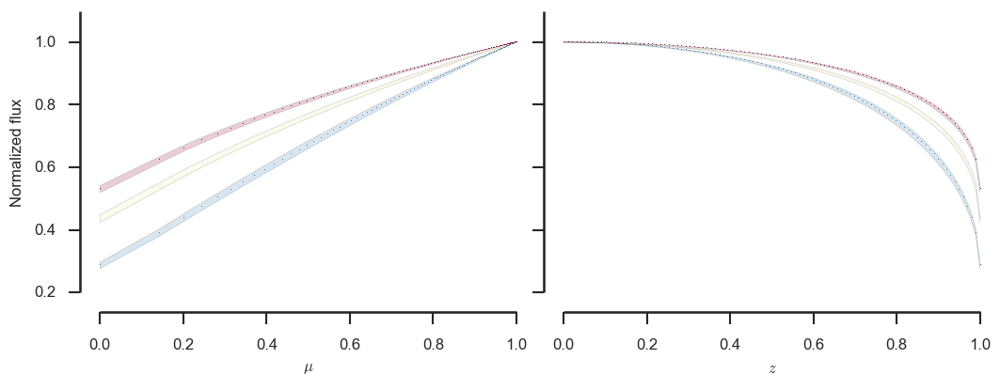
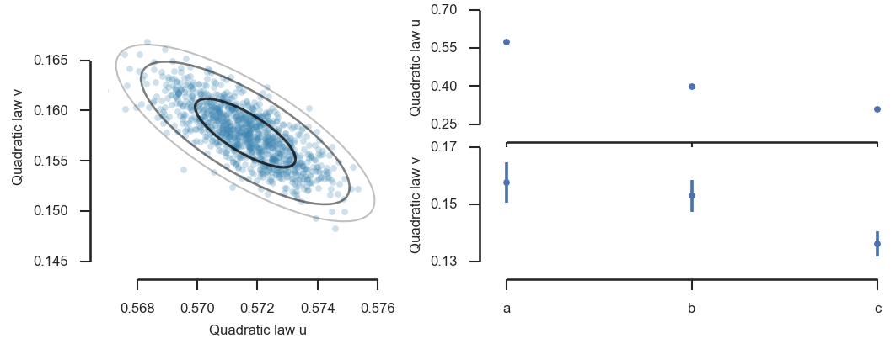

# PyLDTk
Python toolkit for calculating stellar limb darkening profiles and model-specific coefficients for arbitrary filters using the stellar spectrum model library by Husser et al (2013).

```python
from ldtk import LDPSetCreator, BoxcarFilter

filters = [BoxcarFilter('a', 450, 550),  # Define your passbands
           BoxcarFilter('b', 650, 750),  # - Boxcar filters useful in 
           BoxcarFilter('c', 850, 950)]  #   transmission spectroscopy

sc = LDPSetCreator(teff=(6400,   50),    # Define your star, and the code
                   logg=(4.50, 0.20),    # downloads the uncached stellar 
                      z=(0.25, 0.05),    # spectra from the Husser et al.
                   filters=filters)      # FTP server automatically.

ps = sc.create_profiles()                # Create the limb darkening profiles
cq,eq = ps.coeffs_qd(use_mc=True)        # Estimate quadratic law coefficients

lnlike = ps.lnlike_qd([[0.45,0.15],      # Calculate the quadratic law log 
                       [0.35,0.10],      # likelihood for a set of coefficients 
                       [0.25,0.05]])     # (returns the joint likelihood)

lnlike = ps.lnlike_qd([0.25,0.05],flt=0) # Quad. law log L for the first filter
```





## Overview

PyLDTk automates the calculation of custom stellar limb darkening (LD) profiles and model-specific limb darkening coefficients (LDC) using the library of PHOENIX-generated specific intensity spectra by Husser et al. (2013).

The aim of the package is to facilitate exoplanet transit light curve modeling, especially transmission
spectroscopy where the modeling is carried out for custom narrow passbands. The package can be  

1. used to construct model-specific priors on the limb darkening coefficients prior to the transit light curve modeling
2. directly integrated into the log posterior computation of any pre-existing transit modeling code with minimal modifications.

The second approach can be used to constrain the LD model parameter space directly by the LD profile, allowing for the marginalization over the whole parameter space that can explain the profile without the need to approximate this constraint by a prior distribution. This is useful when using a high-order limb darkening model where the coefficients are often correlated, and the priors estimated from the tabulated values usually fail to include these correlations.

## Installation

Simple: clone the source from github and follow the basic Python package installation routine

```bash
 git clone https://github.com/hpparvi/ldtk.git
 cd ldtk
 python setup.py build install [--user]
```

## Examples

Examples for basic and more advanced usage can be found from the `notebooks` directory.

## Model coefficient estimation

## Log likelihood evaluation
The ``LDPSet`` class offers methods to calculate log likelihoods for a set of limb darkening models.

 - ``lnlike_ln`` : Linear model
 - ``lnlike_qd`` : Quadratic model
 - ``lnlike_nl`` : Nonlinear model
 - ``lnlike_gn`` : General model

## Resampling
The limb darkening profiles can be resampled to a desired sampling in ``mu`` using the resampling methods in the ``LDPSet``. 

 - ``resample_linear_z(nz=100)``: Resample the profiles to be linear in z
 - ``resample_linear_mu(nmu=100)``: Resample the profiles to be linear in mu
 - ``reset_sampling()``: Reset back to native sampling in mu
 - ``resample()``:

## Main classes

 - LDPSetCreator : Generates a set of limb darkening profiles given a set of filters and stellar TEff, logg, and z.
 - LDPSet : Encapsulates the limb darkening profiles and offers methods for model coefficient estimation and log likelihood evaluation.

## Known issues

- The Husser et al. library is missing some files that should be there, which sometimes breaks the creation of a structured interpolation grid. This will be fixed in the final release.

## Authors

Hannu Parviainen, University of Oxford

--

Copyright © 2015 Hannu Parviainen <hannu.parviainen@physics.ox.ac.uk>
